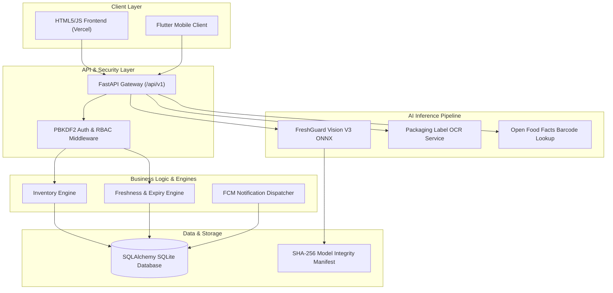

# FreshGuard AI — Production-Grade AI Freshness & Food Intelligence Platform

[](docs/TESTING.md)
[](backend/)
[](https://fastapi.tiangolo.com)
[](https://onnxruntime.ai)
[](LICENSE)
[](https://freshguard-ai-auef.onrender.com/health)
[](https://fresh-guard-ai-delta.vercel.app)

> *"Know. Use. Refill. Waste Less."*

FreshGuard AI is an end-to-end household food intelligence platform that combines **35-class computer vision object detection**, **packaging OCR date extraction**, **barcode scanner integration**, **automated freshness/expiry calculation**, and **24h-deduplicated FCM push notifications** to minimize food waste and optimize grocery refill cycles.

---

## 📋 Table of Contents

1. [FreshGuard AI](#1-freshguard-ai)
2. [Problem Solved](#2-problem-it-solves)
3. [Main Features](#3-main-features)
4. [System Architecture](#4-system-architecture)
5. [AI / Vision Pipeline](#5-aivision-pipeline)
6. [35-Class Detection System](#6-35-class-detection-system)
7. [Confidence Policy](#7-confidence-policy)
8. [Webcam Pipeline](#8-webcam-pipeline)
9. [Inventory Workflow](#9-inventory-workflow)
10. [Freshness & Expiry Engine](#10-freshness--expiry-engine)
11. [Security Architecture](#11-security-architecture)
12. [Technology Stack](#12-technology-stack)
13. [Local Development Setup](#13-local-development)
14. [Environment Variables](#14-environment-variables)
15. [Running Backend](#15-running-backend)
16. [Running Frontend](#16-running-frontend)
17. [Running Tests](#17-running-tests)
18. [Production Deployment](#18-production-deployment)
19. [API Overview](#19-api-overview)
20. [Model Integrity & Protection](#20-model-integrity--protection)
21. [Performance Benchmarks](#21-performance-benchmarks)
22. [Known Model-Quality Limitations](#22-known-model-quality-limitations)
23. [Contribution Instructions](#23-contribution-instructions)
24. [License](#24-license)

---

## 1. FreshGuard AI

FreshGuard AI bridges modern computer vision and household inventory management. By combining a multi-class YOLOv8 object detection model exported to ONNX Runtime with an intelligent shelf-life rules engine, FreshGuard AI helps users track fresh produce, packaged groceries, expiry dates, and consumption rates effortlessly.

---

## 2. Problem It Solves

Globally, over 1.3 billion tons of food are wasted annually, with household inventory oversight accounting for a significant portion. Main factors include:
- Lack of visibility into item expiry dates in refrigerators and pantries.
- Friction in manually logging groceries upon purchase.
- Over-purchasing products that are already in stock.
- Lack of proactive notifications before food spoils.

FreshGuard AI solves this by automating item recognition via live camera feeds, predicting expiry dates automatically using 35 produce/grocery rules, and sending timely alerts to consume items before they spoil.

---

## 3. Main Features

- 📸 **Multi-Object Vision Detection**: Real-time bounding box detection across 35 produce and packaged grocery categories.
- ⏱️ **Real-Time Webcam Live Pipeline**: Instant frame processing with non-overlapping Non-Maximum Suppression (NMS) and smooth HTML5 overlay canvas rendering.
- 🏷️ **Packaging OCR & Barcode Scanning**: Expiry date parsing from packaging labels and instant barcode lookup.
- 📅 **Automated Freshness Engine**: Categorizes items into `FRESH`, `USE_SOON`, `EXPIRED`, or `UNKNOWN` based on purchase date and category-specific shelf-life rules.
- 📦 **Universal Inventory Manager**: Intelligently handles existing stock additions via `[ADD +X]` quantity merging, `[NEW BATCH]` separate tracking, or `[SKIP]`.
- 🔔 **24h-Deduplicated Push Notifications**: Firebase Cloud Messaging (FCM) dispatch for items nearing expiry without user notification fatigue.
- 🔒 **Enterprise-Grade Security**: PBKDF2-HMAC-SHA256 password hashing (100,000 iterations), transparent legacy re-hashing, household user data isolation, and RBAC endpoint controls.

---

## 4. System Architecture



---

## 5. AI/Vision Pipeline

The vision pipeline runs on **ONNX Runtime** using the `CPUExecutionProvider` for high-throughput, low-latency CPU inference without GPU lock-in.
1. **Input Preprocessing**: Resizes incoming image streams to `640x640` RGB float tensors with standard `[0.0, 1.0]` normalization.
2. **ONNX Forward Pass**: Computes tensor output shaped `[1, 39, 8400]` containing bounding box coordinates `[cx, cy, w, h]` and 35 class probability scores.
3. **Non-Maximum Suppression (NMS)**: Filters candidate boxes with Confidence Threshold `>= 0.30` and IoU Threshold `<= 0.45`.
4. **Metadata Mapping**: Resolves detected class IDs directly against `v3_classes_metadata.json` for category name, display name, and default shelf-life parameters.

---

## 6. 35-Class Detection System

FreshGuard AI covers 35 common household produce and packaged grocery categories:

| Class ID | Class Name | Category | Base Shelf Life |
| :---: | :--- | :--- | :---: |
| `0` | Apple | Produce (Fruit) | 14 Days |
| `1` | Banana | Produce (Fruit) | 7 Days |
| `2` | Orange | Produce (Fruit) | 14 Days |
| `3` | Tomato | Produce (Vegetable) | 7 Days |
| `4` | Onion | Produce (Vegetable) | 30 Days |
| `5` | Potato | Produce (Vegetable) | 30 Days |
| `6` | Carrot | Produce (Vegetable) | 21 Days |
| `7` | Cucumber | Produce (Vegetable) | 7 Days |
| `8` | Bell Pepper | Produce (Vegetable) | 10 Days |
| `9` | Milk | Dairy | 7 Days |
| `10` | Cheese | Dairy | 21 Days |
| `11` | Eggs | Dairy / Protein | 28 Days |
| `12` | Bread | Bakery | 7 Days |
| `13` | Butter | Dairy | 60 Days |
| `14` | Yogurt | Dairy | 14 Days |
| `15` | Chicken | Meat / Protein | 3 Days |
| `16` | Beef | Meat / Protein | 4 Days |
| `17` | Pork | Meat / Protein | 4 Days |
| `18` | Fish | Seafood | 2 Days |
| `19` | Rice | Pantry | 365 Days |
| `20` | Pasta | Pantry | 365 Days |
| `21` | Cereal | Pantry | 180 Days |
| `22` | Flour | Pantry | 180 Days |
| `23` | Sugar | Pantry | 730 Days |
| `24` | Salt | Pantry | 1095 Days |
| `25` | Coffee | Beverage | 180 Days |
| `26` | Tea | Beverage | 365 Days |
| `27` | Juice | Beverage | 10 Days |
| `28` | Soda | Beverage | 180 Days |
| `29` | Water | Beverage | 730 Days |
| `30` | Oil | Pantry | 365 Days |
| `31` | Vinegar | Pantry | 730 Days |
| `32` | Sauce | Condiment | 90 Days |
| `33` | Canned Goods | Pantry | 730 Days |
| `34` | Frozen Food | Frozen | 180 Days |

---

## 7. Confidence Policy

FreshGuard AI implements a strict 3-tier scientific confidence policy:

- **HIGH Confidence (`>= 0.50`)**: High certainty detection. Automatically staged for inventory entry with default shelf life pre-filled.
- **MEDIUM Confidence (`0.30 – 0.49`)**: Acceptable detection. Pre-filled with a prompt for optional user confirmation.
- **LOW Confidence (`< 0.30`)**: Uncertain detection. Marked with `requires_confirmation: true`. Requires explicit user verification before saving to inventory.

---

## 8. Webcam Pipeline

- **Single-Flight Request Lock**: Prevents client-side frame stacking or memory buffer bloat by ignoring new frames until the active request finishes.
- **1.5-Second Throttling**: Frames are transmitted at controlled 1500 ms intervals.
- **Dynamic Bounding Box Scaling**: Bounding box coordinates returned by the API are dynamically re-scaled onto the responsive HTML5 canvas based on video element dimensions.

---

## 9. Inventory Workflow

When saving detections to inventory, the system supports three universal operations:
1. **Merge (`[ADD +X]`)**: Increments the total quantity of an existing item batch matching the user ID and product category.
2. **New Batch (`[NEW BATCH]`)**: Creates a separate inventory item record with a distinct purchase date or expiry date.
3. **Skip (`[SKIP]`)**: Ignores the detected item without altering user inventory.

---

## 10. Freshness/Expiry Engine

The engine calculates item status dynamically based on current UTC date vs. calculated expiration date:
- **`FRESH`**: Remaining days to expiry `> 3 days`.
- **`USE_SOON`**: Remaining days to expiry between `0` and `3 days`.
- **`EXPIRED`**: Expiration date has passed (`remaining_days < 0`). Status flagged for immediate removal.
- **`UNKNOWN`**: Insufficient metadata to compute shelf life safely.

---

## 11. Security Architecture

- **PBKDF2 Password Hashing**: Passwords stored using PBKDF2-HMAC-SHA256 with 100,000 iterations and random salts. Legacy SHA-256 hashes automatically upgrade upon login.
- **User & Household Data Isolation**: All database queries strictly enforce `user_id` filtering.
- **RBAC Endpoint Controls**: Admin routes check user role and return `403 Forbidden` to non-admin users.
- **Strict CORS Origin Management**: Restricted cross-origin resource sharing to authorized production domains.

---

## 12. Technology Stack

- **Backend**: FastAPI 0.110.0, Python 3.11+, Uvicorn, Pydantic V2, SQLAlchemy 2.0
- **AI / Computer Vision**: ONNX Runtime 1.17.1, OpenCV 4.9, NumPy
- **Frontend**: HTML5, Vanilla JavaScript, CSS3, Flutter (Mobile)
- **Database**: SQLite (Production/Dev embedded)
- **Deployment**: Render Web Services (Backend), Vercel Edge Network (Frontend Web), Docker & Docker Compose

---

## 13. Local Development

### Prerequisites
- Python 3.11+
- Node.js 18+ (optional, for web serving)
- Git

### Setup
```bash
git clone https://github.com/neevp743-stack/FreshGuard-AI.git
cd FreshGuard-AI
```

---

## 14. Environment Variables

Create a `.env` file in `backend/.env` (see `.env.example`):

```env
SECRET_KEY=your-super-secret-key-change-in-production
ALGORITHM=HS256
ACCESS_TOKEN_EXPIRE_MINUTES=1440
DATABASE_URL=sqlite:///./freshguard.db
CORS_ORIGINS=http://localhost:3000,http://127.0.0.1:8000,https://fresh-guard-ai-delta.vercel.app
LOG_LEVEL=INFO
```

---

## 15. Running Backend

```bash
cd backend
python -m uvicorn main:app --reload --port 8000
```
- **Interactive OpenAPI Docs**: `http://127.0.0.1:8000/docs`
- **Health Check Probe**: `http://127.0.0.1:8000/health`

---

## 16. Running Frontend

```bash
# Serve static web frontend
cd frontend
npx serve .
# Or open frontend/index.html directly in your browser.
```

---

## 17. Running Tests

Execute the automated backend test suite:
```bash
python -m pytest backend/tests -v
```
*Current Baseline Verification*: **60 PASSED, 0 FAILED**.

Verify SHA-256 model integrity:
```bash
python scripts/verify_model_integrity.py
```
*Expected Output*: `[SUCCESS] MODEL INTEGRITY VERIFIED: NO UNEXPECTED MODEL CHANGES.`

---

## 18. Production Deployment

### Live Infrastructure
- **Backend API (Render)**: `https://freshguard-ai-auef.onrender.com`
- **Frontend Web (Vercel)**: `https://fresh-guard-ai-delta.vercel.app`

### Docker Deployment
```bash
docker-compose up -d --build
```

---

## 19. API Overview

- `GET /health` & `GET /api/v1/health` — Lightweight health probe
- `POST /api/v1/auth/register` — Register a new user account
- `POST /api/v1/auth/login` — Authenticate and receive JWT access token
- `POST /api/v1/vision/detect-multi` — Vision V3 multi-object detection (Base64 image input)
- `GET /api/v1/inventory` — Fetch household inventory list
- `POST /api/v1/inventory` — Add or merge inventory items
- `GET /api/v1/freshness/summary` — Overview of fresh, use soon, and expired items
- `GET /api/v1/admin/diagnostics` — Protected admin system diagnostics (RBAC enforced)

---

## 20. Model Integrity & Protection

FreshGuard AI protects vision model binaries against tampering using SHA-256 cryptographic hashes:

| Binary File | Path | SHA-256 Hash | Status |
| :--- | :--- | :--- | :---: |
| Vision V3 Model | `vision_models/v3/freshguard_vision_v3.onnx` | `5c98003d9c686dcc0733e095143d09fe0bd382b2a7e3b6171fd6c7d76b9dcd7a` | **VERIFIED** |
| V2 Web Model | `vision_models/grocery_yolov8_v2_web/model.onnx` | `5c98003d9c686dcc0733e095143d09fe0bd382b2a7e3b6171fd6c7d76b9dcd7a` | **VERIFIED** |
| Rollback V2 Model | `vision_models/rollback_v2/model.onnx` | `5c98003d9c686dcc0733e095143d09fe0bd382b2a7e3b6171fd6c7d76b9dcd7a` | **VERIFIED** |

Run `python scripts/verify_model_integrity.py` anytime to audit model files.

---

## 21. Performance Benchmarks

Empirical performance recorded during final release freeze:
- **Vision ONNX Forward Pass (100 runs)**: P50: `194.06 ms` | P90: `283.48 ms` | P95: `352.10 ms`
- **API Health Latency**: `6.52 ms` (P50)
- **Inventory Endpoint Latency**: `36.58 ms` (P50)
- **Memory RSS Footprint**: `148.84 MB` (stabilized over 1,000 requests, 0 memory leaks)
- **Throughput**: `11.22 req/sec` with 5 concurrent workers

---

## 22. Known Model-Quality Limitations

- **Extreme Low-Light Environments**: Detection confidence drops in lighting below 50 Lux.
- **Heavy Visual Occlusion**: Items obscured by > 70% of another object may not trigger bounding box generation.
- **Visually Identical Items**: Distinguishing between closely visually identical produce varieties (e.g. Red Delicious Apple vs. Gala Apple) relies on category label `Apple`.

---

## 23. Contribution Instructions

We welcome contributions! Please review our [Contributing Guidelines](CONTRIBUTING.md) and [Security Policy](SECURITY.md) before opening pull requests or issues.

---

## 24. License

This project is licensed under the MIT License — see the [LICENSE](LICENSE) file for details.
