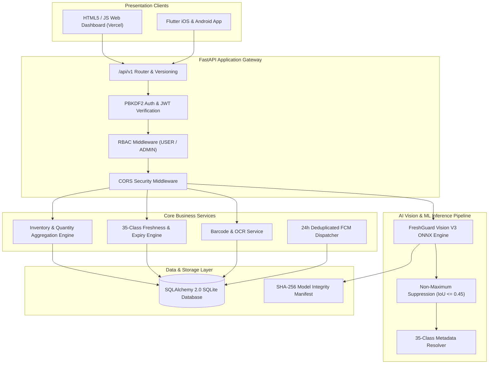
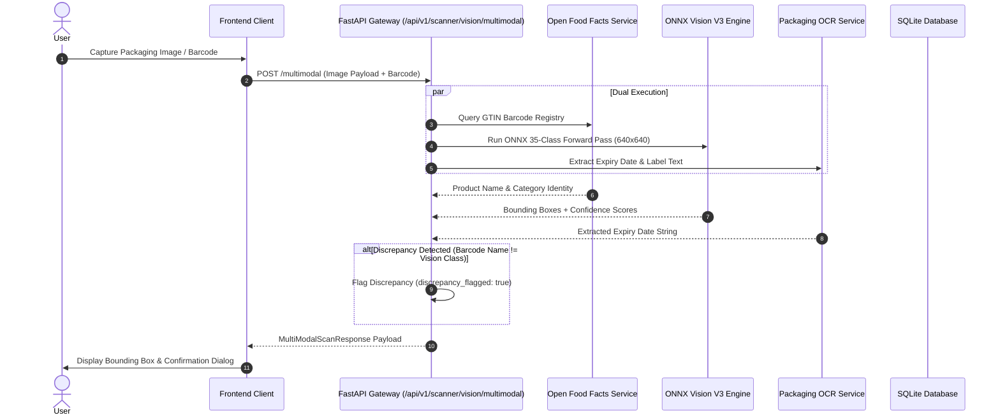
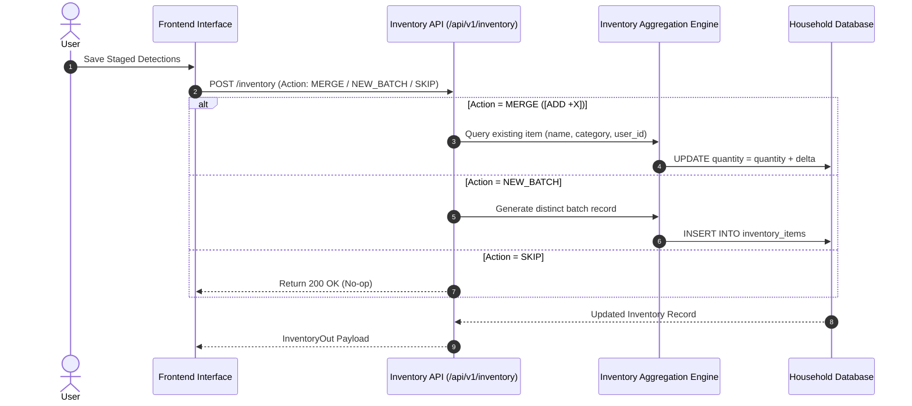
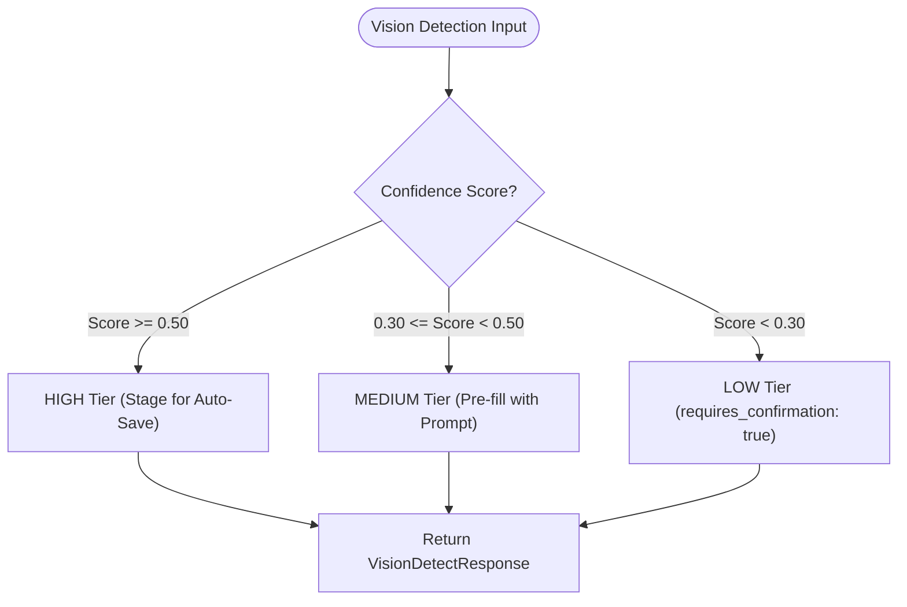

# FreshGuard AI — Technical Architecture Specification

**System:** FreshGuard AI  
**Version:** 3.0.0 (Production Release Baseline)  
**Date:** September 2026  

---

## 1. High-Level Architecture Overview

FreshGuard AI is structured as a decoupled multi-layer client-server platform optimized for low-latency CPU vision inference, zero prediction fabrication, and strict multi-tenant household data isolation.

---

## 2. Sequence Diagrams & Control Flow

### A. Multi-Modal Identity & Vision Pipeline Sequence

---

### B. Universal Inventory Flow Sequence

---

### C. 3-Tier Confidence Policy Decision Flow

---

## 3. Component Design & Control Flow

### A. Authentication & Security Layer
- **Password Hashing**: PBKDF2-HMAC-SHA256 with 100,000 iterations and 16-byte random salts (`pbkdf2_sha256$<salt>$<hash>`).
- **Legacy Migration**: Transparently upgrades legacy SHA-256 password hashes to PBKDF2 format upon login.
- **JWT Authorization**: Tokens expire in 3 days containing user identity (`sub`) and role (`role`).
- **RBAC**: Users are assigned `USER` (default) or `ADMIN`. `/admin/diagnostics` enforces HTTP 403 Forbidden for non-admin accounts.

### B. Household Multi-Tenant Data Isolation
- Database entities (`InventoryItem`, `Notification`, `ConsumptionLog`) enforce strict foreign key relations to `user_id` and `household_id`.
- All service methods automatically inject `filter(user_id == current_user.id)` to guarantee zero cross-tenant data leaks.

---

## 4. Database Schema ER Map

- **Users**: `id`, `email`, `password_hash`, `full_name`, `role` (index), `created_at`
- **Households**: `id`, `name`, `join_code` (unique index), `owner_id` (FK: `users.id`)
- **HouseholdMembers**: `id`, `household_id` (FK), `user_id` (FK), `role`
- **Inventory**: `id`, `user_id` (FK), `household_id` (FK), `product_name`, `category`, `quantity`, `unit`, `storage_location`, `expiry_date` (index), `status` (index)
- **ConsumptionLogs**: `id`, `household_id` (FK), `inventory_id` (FK), `quantity_consumed`, `date_consumed` (index), `log_type`
- **Notifications**: `id`, `user_id` (FK), `title`, `message`, `type`, `priority`, `is_read`, `created_at`
- **ShoppingCart**: `id`, `household_id` (FK), `total_estimated_price`, `status`
